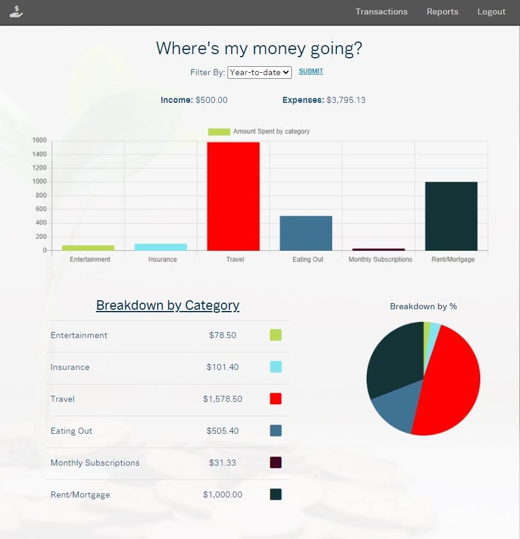

# Pretty-fast-books

> Website: https://pretty-fast-books.herokuapp.com/

> API used: https://plaid.com/

> Schema: https://app.quickdatabasediagrams.com/#/d/H5b3UE

## Usage
This site is still in sandbox mode. First, create your account, and then you'll be asked to login to a bank. For this step, use this login information:
* Username: user_good
* Password: pass_good

## Tech Stack
This project utilizes the following technologies:
* Python / Flask
* HTML/CSS
* Javascript
* Postgres
* Bcrypt

## Overview
This website is designed to be a basic version of quickbooks. You'll be able to import transactions directly from your bank, and then sort each transaction based on categories you create. This will allow the user to easily see where their money is being spent and then plan their budget accordingly. They can sort their income/expenses by month, year, or by all available transactions. 

